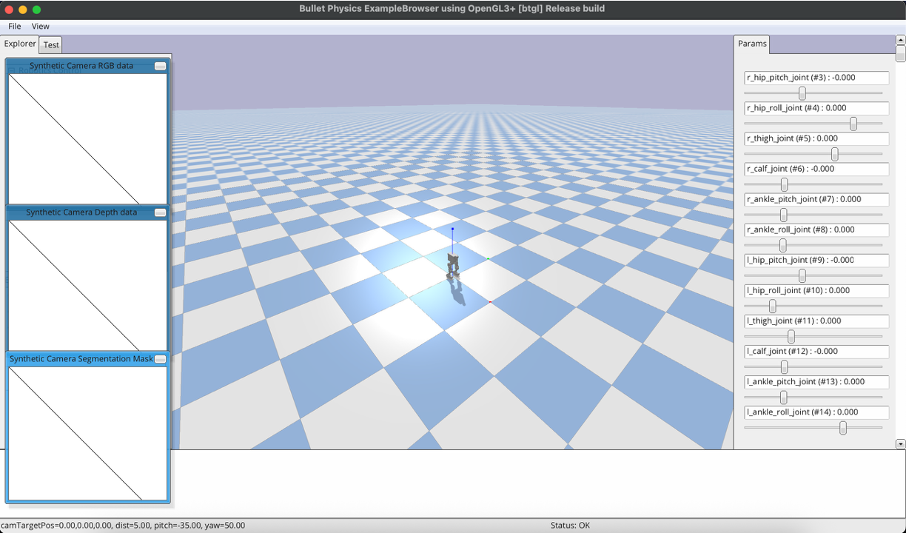

# MakeCU PyBullet Workshop

This project loads the `clpai_12dof_0905.urdf` robot into a PyBullet simulation. The script can run headless or with the PyBullet GUI.





## Requirements
- Python 3.11 or newer
- `pybullet` (installed automatically via `pip install .`)

## Install uv
Use [uv](https://github.com/astral-sh/uv) for fast, reproducible installs:

- macOS / Linux:
  ```bash
  curl -LsSf https://astral.sh/uv/install.sh | sh
  ```
- Windows (PowerShell):
  ```powershell
  powershell -ExecutionPolicy Bypass -c "irm https://astral.sh/uv/install.ps1 | iex"
  ```

## Setup
```bash
python -m venv .venv
source .venv/bin/activate
pip install --upgrade pip
pip install .
```

## Usage

### GUI mode
Add the `--gui` flag to open the PyBullet visualizer:
```bash
uv run src/main.py --gui
```

### Simulation controls
- `--steps`: number of simulation steps (default: 2400)
- `--timestep`: duration of each simulation step in seconds (default: `1/240`)

### Forward motion
Use the forward-motion options to command the robot base to walk:
- `--walk-mode`: `time` (default) walks for a duration, `distance` walks until the travelled distance is reached.
- `--walk-amount`: seconds or meters depending on the mode (default: 3).
- `--walk-speed`: forward speed in m/s (default: 1.0).

Example: move forward for three meters in the GUI.
```bash
uv run src/main.py --gui --walk-mode distance --walk-amount 3
```

### Rotation motion
After the forward walk completes, the simulation can execute an in-place turn that mimics the ROS `cmd_vel` angular.z command:
- `--turn-angle`: yaw rotation in degrees (positive turns counter-clockwise, default: 90). Set to `0` to skip the turn.
- `--turn-speed`: yaw rotation speed in degrees per second (default: 45).

Example: walk for two seconds then rotate 45 degrees right at 60 deg/s.
```bash
uv run src/main.py --gui --walk-amount 2 --turn-angle -45 --turn-speed 60
```

### Keyboard teleoperation
Control the robot live from the PyBullet GUI using the arrow keys:
```bash
uv run src/main_keyboard.py --gui
```

Controls:
- Up Arrow: walk forward
- Down Arrow: walk backward
- Left Arrow: rotate counter-clockwise
- Right Arrow: rotate clockwise
- Space: stop the current motion and clear the queue
- Esc or `q`: exit

You can tune the distance and speed per key press with `--forward-distance` and `--forward-speed`, and adjust rotation behavior with `--turn-angle` and `--turn-speed`. Use `--queue-limit` to cap how many motions can be queued.

### URDF loader utility
Use the lightweight loader to spawn any URDF (including the workshop robot) without the motion controllers:
```bash
uv run src/1_urdf_loader.py --gui --urdf robot/clpai_12dof_0905.urdf
```
- `--gui` toggles the PyBullet visualizer (omit for DIRECT/headless).
- `--urdf PATH` points to a specific URDF (defaults to the bundled robot).
- `--resource-root DIR` overrides the mesh search directory if your URDF references external assets.
- `--fixed-base`, `--no-plane`, `--timestep`, `--settle-steps`, `--run-seconds`, and `--gravity` mirror the script’s CLI so you can quickly test spawn parameters.
Run `python src/1_urdf_loader.py --help` to inspect the full option list.

### RL training
Train policies with Stable-Baselines3 via `src/rl_training.py`:
```bash
uv run python src/rl_training.py --algo PPO --num-agents 8 --total-timesteps 3000000
```
- `--num-agents` controls how many vectorized environments run in parallel; increase to speed up headless training.
- Add `--gui` to visualize the PyBullet simulation (the script automatically forces a single agent for GUI stability):
  ```bash
  uv run python src/rl_training.py --gui --algo SAC --total-timesteps 10000
  ```
- Use `--checkpoint-dir` to choose where the policy (`*_model.zip`) and normalization stats (`*_vecnorm.pkl`) are stored; defaults to `checkpoints/`.

### Example
```bash
uv run src/main.py --gui --steps 1200 --timestep 0.01
```

## Troubleshooting
- If you see `ModuleNotFoundError: No module named 'pybullet'`, ensure the virtual environment is active and dependencies are installed (`pip install .`).
